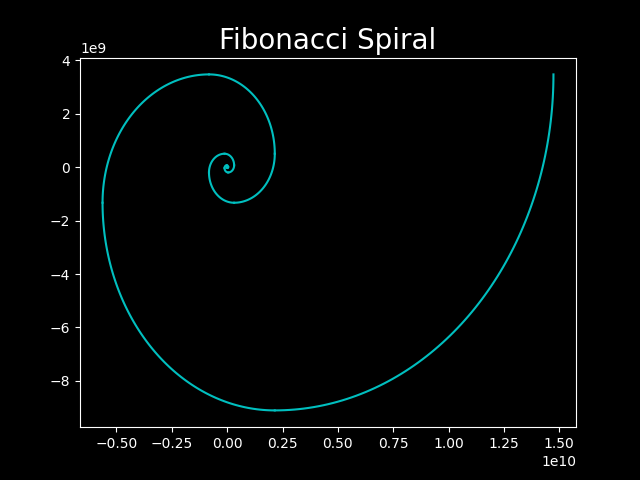
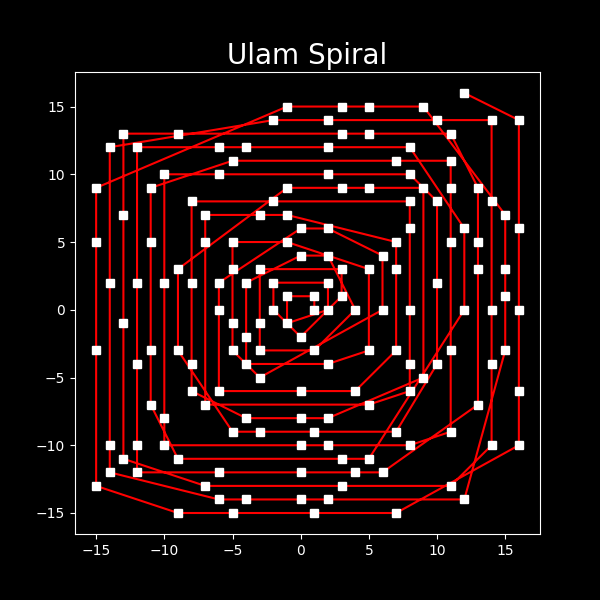

# beautiful things

## Description
this is just a hobby thing. I'm trying to try all beautiful things in maths or any other domains which I can visualize using code.

## Why?

## Want to add something?
you are free to make a pull request. I'll merge it if it's beautiful enough. I'll also add your name in the contributors list. Just make sure background is black (I'm racist sue me).

<!-- insert image aisehi.jpeg-->

## Works

### fibonacci spiral

### ulam spiral

### 3n+1 problem
 

### mandelbrot set

### Sierepinski triangle

