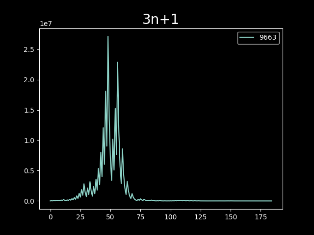

# beautiful things

## Description
this is just a hobby thing. I'm trying to try all beautiful things in maths or any other domains which I can visualize using code.

## Why?
aise hi sexy lag raha tha

<!-- insert image aisehi.jpeg-->

## Works

### fibonacci spiral

### ulam spiral

### 3n+1 problem

